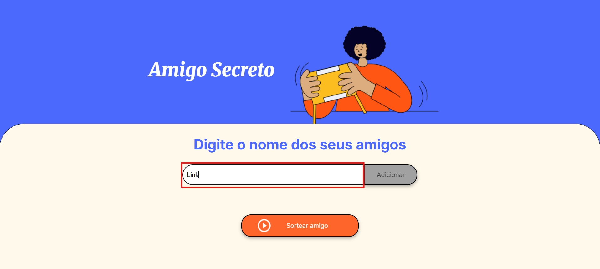
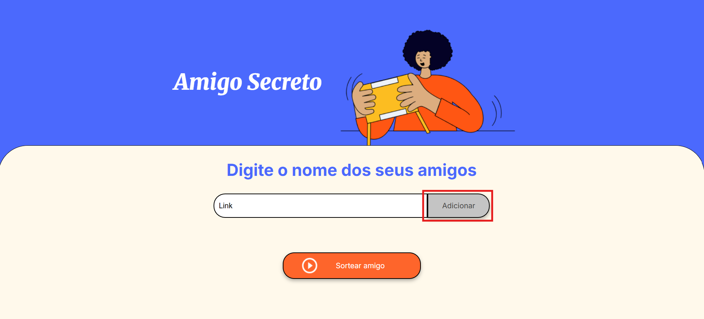
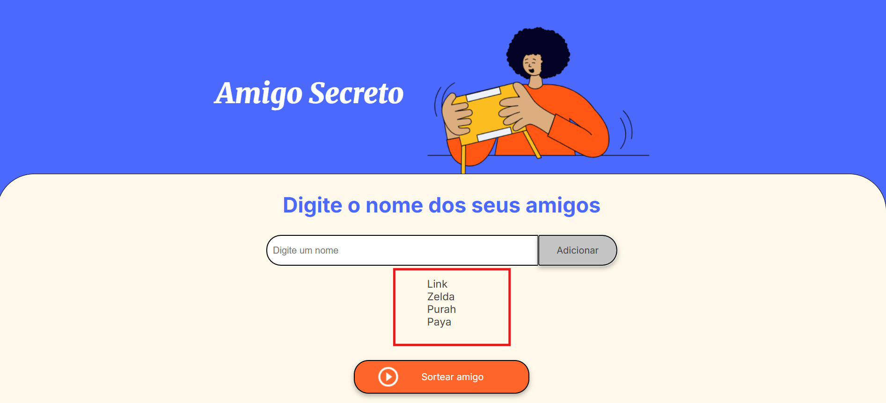
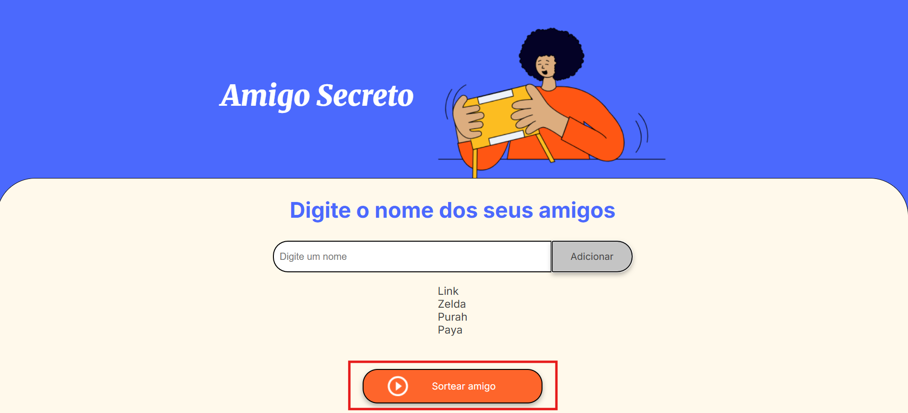
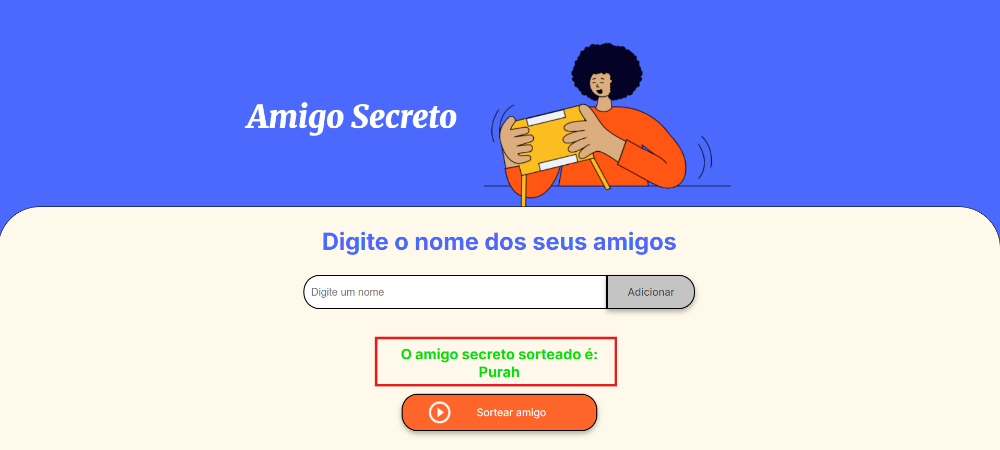

# Projeto Amigo Secreto 🎉

Este é um projeto simples e funcional de "Amigo Secreto" desenvolvido para gerenciar a lista de participantes e realizar sorteios de forma aleatória.

## Funcionalidades 🚀

- **Adiciona participantes**: Permite inserir nomes na lista.
- **Exibe uma lista de participantes**: Exibe todos os nomes adicionados em um lista abaixo da caixa de texto.
- **Realiza o sorteio**: Escolhe um participante aleatoriamente e o exibe como o "amigo secreto".

## Tecnologias Utilizadas 🛠️

  
  
  

## Como Usar 👨‍💻

### Certifique-se de que seu navegador suporta JavaScript e que ele está habilitado para o projeto funcionar corretamente.

1. Clone o repositório com o comando:

   git clone https://github.com/seu-usuario/projeto-amigo-secreto.git

    - Descompacte a pasta no local de sua preferência
    - Abra a pasta e dê um duplo clique no arquivo index.html
    - Na caixa de texto, digite o nome que você deseja adicionar ao sorteio e clique no botão adicionar
    - Após ter adicionado os nomes de sua escolha, clique no botão Sortear amigo
    - O nome do amigo será apresentado logo abaixo

## Capturas de Tela 🖥️

### Digitando Nomes

### Adicionando Nomes

### Amigos Adicionados

### Sortear Amigos

### Amigo Sorteado

## Demonstração  🎬

[🎥 Clique aqui para assistir à demonstração no YouTube](https://www.youtube.com/watch?v=WNbjXWlluKo)
